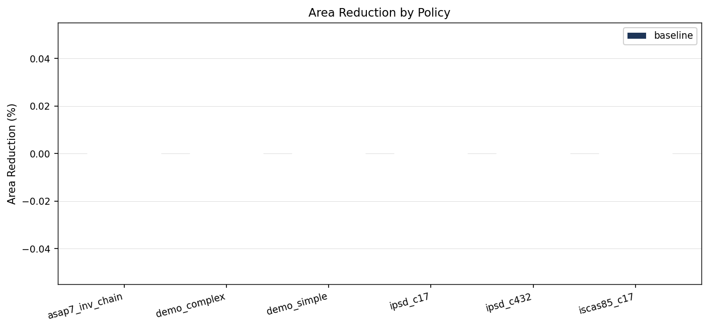
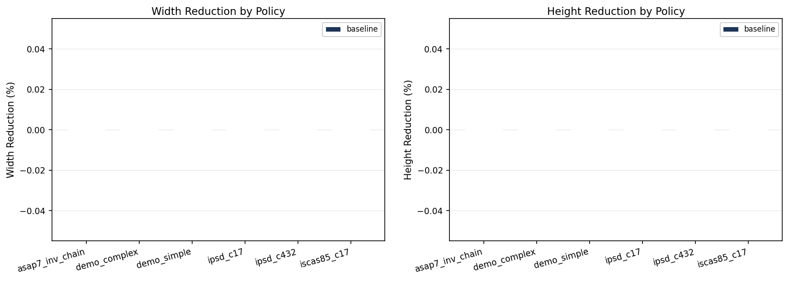
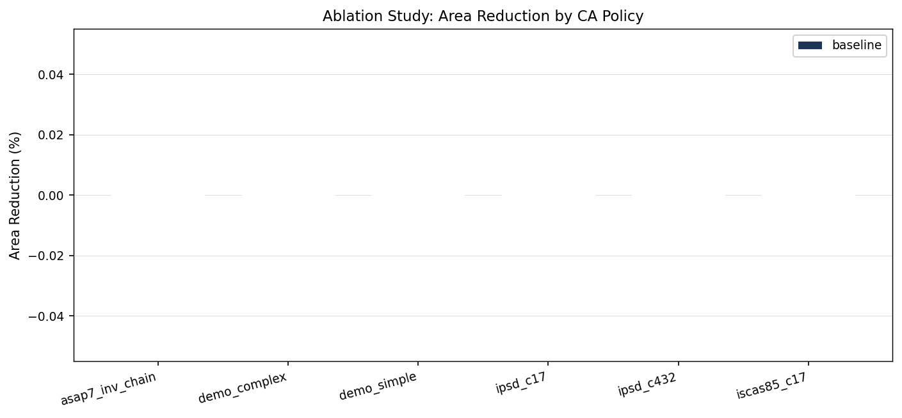
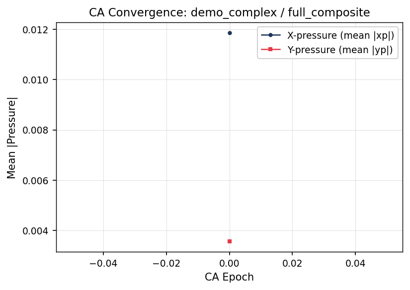
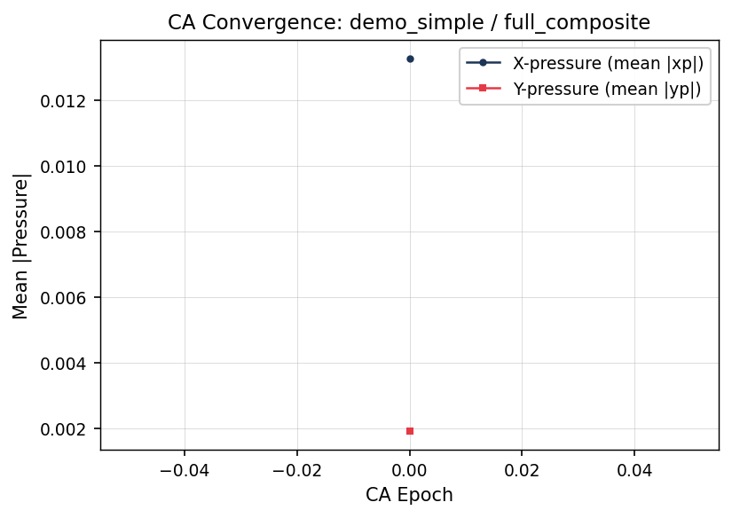
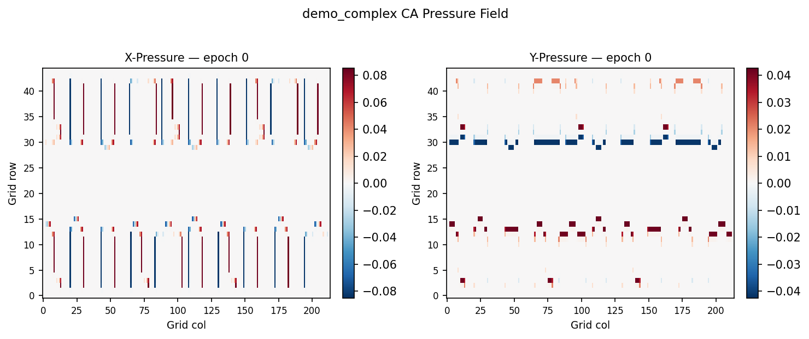
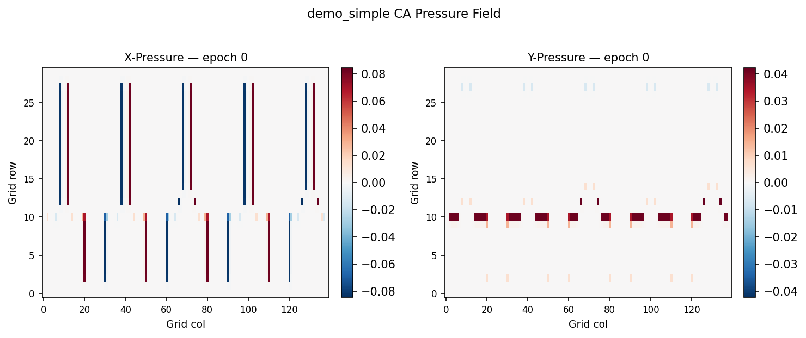

# Rule-Based Cellular Automata Compaction Framework for VLSI Physical Design

A modular research framework that wraps the
[Cell-Based-Layout-Compaction](https://github.com/AmeerAbdelhadi/Cell-Based-Layout-Compaction)
Perl engine with a deterministic, rule-based 2D cellular automata (CA) planning layer.

The CA operates over a discretized geometry occupancy grid and drives pre-compaction
ordering, directional pressure assignment, adaptive shrink scheduling, and iteration
count planning. The Perl backend performs detailed cell-based compaction using a
modified segment-tree data structure on CIF input/output.

---

## Repository Architecture

```
src/
  io/          CIF reader/writer, benchmark manifests, IPSD/ISCAS adapters
  backend/     Perl engine wrapper (cellCompaction.pl), command runner, output parser
  ca/          Grid discretizer, state encoder, neighborhood ops, rule engine,
               epoch scheduler, composite rule library
  geometry/    Polygon utils, overlap estimator, spatial metrics, region partitioner
  planning/    Pre-compaction ordering, directional pressure, shrink-factor planner,
               iteration scheduler
  eval/        Baseline eval, CA-enhanced eval, ablation runner, metrics reporter
  viz/         Layout plotter, chart generator, heatmap plotter, figure exporter
  report/      README updater, Markdown summary generator
scripts/       fetch_benchmarks.sh  convert_inputs.sh  run_baseline.sh
               run_ca_compaction.sh  run_ablation.sh  make_report.sh
docker/        Dockerfile  docker-compose.yml  entrypoint.sh
configs/       default.yaml  ca_rules.yaml  benchmarks.yaml  asap7.yaml
data/demo/     demo_simple.cif  demo_complex.cif  (synthetic test layouts)
outputs/       figures/  compacted_layouts/  tables/  logs/  reports/
vendor/        Place cellCompaction.pl here (see vendor/README.md)
```

---

## CA Rule Summary

The default policy is a **full composite** deterministic rule set:

| Rule | Description |
|---|---|
| **Free-space attraction** | Increases pressure toward directions with local free space |
| **Conflict repulsion** | Reduces pressure in high-conflict (high-occupancy) neighborhoods |
| **Connectivity preservation** | Aligns directional bias with topological neighbors to reduce fragmentation |
| **Boundary guard** | Zeroes boundary-facing pressure components at layout margins |
| **Alternating-axis schedule** | Alternates X / Y emphasis each epoch to match the backend's iteration style |
| **Shrink adaptation** | Derives Xshrf/Yshrf from local congestion and pressure magnitude |
| **Stabilization** | Marks converged cells ineligible to reduce oscillation |

Neighborhood: configurable Moore (8-connected, default) or von Neumann (4-connected).

---

## Backend Integration

The framework calls:
```
perl vendor/cellCompaction.pl -iter N -Xshrf a -Yshrf b -input in.cif -comp out.cif
```

The CA planning layer determines `N`, `a`, and `b` per-benchmark before each backend
call. Backend knobs exposed: `iter`, `Xshrf`, `Yshrf`, `input`, `comp`.

---

## Obtaining the Backend

```bash
mkdir -p vendor
git clone https://github.com/AmeerAbdelhadi/Cell-Based-Layout-Compaction tmp_upstream
cp tmp_upstream/cellCompaction.pl vendor/
rm -rf tmp_upstream
# Upstream license is preserved in UPSTREAM_LICENSE
```

---

## Benchmark Preparation

### Demo layouts (always available)
```
data/demo/demo_simple.cif    # 5-cell synthetic layout
data/demo/demo_complex.cif   # 20-cell synthetic layout
```

### IPSD benchmarks
Place layout-ready CIF files under `data/benchmarks/ipsd/`.
The pipeline, conversion hooks, and metric reporting are fully implemented;
they activate automatically once files are present.

### ISCAS-85/89 benchmarks
ISCAS benchmarks are gate-level netlists and require an external synthesis + P&R
flow to produce CIF. Place converted CIF under `data/benchmarks/iscas/`.

### ASAP7
Set `pdk_root` in `configs/asap7.yaml` after obtaining the PDK
(academic license: https://github.com/The-OpenROAD-Project/asap7).
Run `make convert` to extract cell CIF views.

---

## Docker Usage

```bash
# Build image
make docker-build

# Run full experiment pipeline
docker compose -f docker/docker-compose.yml run --rm compaction full-run

# Specific targets
docker compose -f docker/docker-compose.yml run --rm compaction baseline
docker compose -f docker/docker-compose.yml run --rm compaction ablation
docker compose -f docker/docker-compose.yml run --rm compaction report
```

Volumes: mount `data/` read-only and `outputs/` read-write.

---

## Evaluation Commands

```bash
# Install Python dependencies
make install

# Run backend-only baseline
make baseline

# Run CA-enhanced compaction (full composite policy)
make ca-run

# Run all ablation configurations
make ablation

# Generate figures and update README
make report

# Clean outputs
make clean
```

---

## Ablation Configurations

| Policy | Rules enabled |
|---|---|
| `backend_only` | None (pure backend) |
| `simple_directional` | Free-space attraction |
| `free_space_repulsion` | Free-space + conflict repulsion |
| `full_composite` | All 7 rules (default) |
| `adaptive_shrink` | Free-space + repulsion + shrink adaptation + alternating axis |

Neighborhood comparison: Moore vs. von Neumann is configurable via `configs/ca_rules.yaml`.

---

## Metrics Reported

- Total layout area before/after compaction
- Width and height reduction (%)
- Bounding-box reduction percentage
- Overlap count (bbox proxy)
- Spacing violation proxy (when full DRC unavailable)
- Runtime (seconds)
- Iteration count
- CA epoch count and convergence flag

---

<!-- RESULTS-BEGIN -->
## Results Summary

| Benchmark | Policy | Area Red. (%) | Width Red. (%) | Height Red. (%) | Overlaps After | Runtime (s) | Backend OK |
|---|---|---:|---:|---:|---:|---:|:---:|
| demo_simple | baseline | 0.00 | 0.00 | 0.00 | 0 | 0.00 | no |
| demo_complex | baseline | 0.00 | 0.00 | 0.00 | 0 | 0.00 | no |

### Skipped Benchmarks

| Benchmark | Policy | Reason |
|---|---|---|
| ipsd_c17 | baseline | IPSD layout-ready CIF not publicly distributed. Provide c17.cif under data/bench |
| ipsd_c432 | baseline | Same prerequisite as ipsd_c17. Place c432.cif in data/benchmarks/ipsd/. |
| iscas85_c17 | baseline | ISCAS-85 netlists require a full synthesis + P&R flow to produce layout-ready CI |
| asap7_inv_chain | baseline | ASAP7 7nm PDK cell views are available under academic license from https://githu |

## Figures

### Area Reduction by Policy



### Width and Height Reduction



### Ablation Study Comparison



### CA Convergence: demo_complex



### CA Convergence: demo_simple



### Pressure Field: demo_complex



### Pressure Field: demo_simple



<!-- RESULTS-END -->

---

## Known Limitations

- **Backend prerequisite**: `cellCompaction.pl` is not bundled; it must be obtained
  from the upstream repository (BSD-style license, see `UPSTREAM_LICENSE`).
- **Benchmark collateral**: IPSD, ISCAS, and ASAP7 benchmarks require external
  license steps or P&R flows. All adapter code and skip logic is implemented;
  only the input CIF files are missing.
- **DRC proxy**: Full design-rule checking requires a technology-specific DRC engine.
  This framework reports a spacing-violation proxy (bbox edge spacing vs. min spacing).
- **CA layer is advisory**: The CA improves compaction inputs but does not replace
  the detailed compaction step; the Perl backend remains the correctness-critical stage.
- **CIF scope**: The reader handles standard DS/DF/B/P/W/L/C constructs; exotic
  CIF extensions (mirror transforms, rotation) are not yet implemented.
